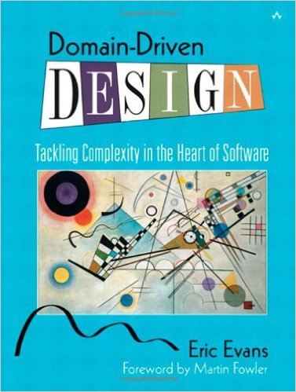

class: middle hide-slide-number

# Building beautiful systems

#### Phoenix Contexts and Domain-Driven Design


Andrew Hao [@andrewhao](https://www.twitter.com/andrewhao)


---

class: middle center

## Hi, I'm Andrew

Friendly neighborhood programmer at Carbon Five

---

class: middle center background-color-carbonfive


---

class: center

#### .left[Axiom #1 🔮]
# Maintaining large systems is difficult*

--
#### * like, super mega difficult

???

As you might know, a good portion of our professional lives as programmers is spent chasing the dragons of complexity

---

### Large software systems can get messy.

- tight coupling
- concepts with low cohesion - spaghetti code
- hidden dependencies.
- can't keep it in your head.

???

As you may be well aware, large systems are difficult to grow and maintain.

---

class: center

#### .left[Axiom #2 🔮]
# Complex systems are not intentionally messy*

--
#### * for the most part

---

### The bulk of complexity is accidental

Let's ship things fast! 😧

--

Death by a thousand cuts

--

Abstractions that might work for small systems can't scale when the system grows.

---

class: middle center

#### The solution?

### Intermediate organization structures

???

Science shows we can keep everything between four to seven things in memory at once!

At certain point, you need to introduce abstraction layers

---

class: middle
## But!

- Where do I draw boundaries between my abstractions?

---

class: middle center

# 🤔💭

If only we had a set of criteria to understand how to decompose our systems!

---

class: middle

#### A blast from the past 🕰

### Information hiding

[_D.L. Parnas - "On the Criteria to Be Used in Decomposing Systems into Modules"_](https://www.cs.umd.edu/class/spring2003/cmsc838p/Design/criteria.pdf)

???

So I went looking for some inspiration, and learned about Parnas' work
about modularization in the 1970s, words that stand still today.

---

class: middle center background-image-contain background-white

background-image: url(images/parnas-paper.png)

???

In this paper, he took a look at a program that did text processing and
compared two approaches - one that divided up its processing
responsibilities by its procedural components, do A, B, then C, and
another one that was responsible for the individual design decisions to
do various things like scan for words, storing data in internal data
structures, etc.

It might go without saying, but the second one was found much more
flexible and elegant. He said that the second way allowed the user to
change internal decisions like how lines were stored in memory or on
disk in a particular data structure would require minimal changes,
whereas in the first, if you changed the data structure backing the word
list you'd have to change several modules.

---

class: middle

"We propose instead that one begins with a **list of difficult design decisions** or **design decisions which are likely to change**.

"Each module is then designed to **hide such a decision from the others.**" (Emphasis added)

???

His point was that modules need to hide away minute implementation
details from other modules - things that are likely to change! Where you
draw the boundaries in your system matters, because they allow you to
flexibly change your approach without messing with other parts of the
system later.

Sounds obvious, right? This paper eventually got the discussion rolling
into the design principles which we call "High Cohesion, Loose Coupling"
today.

---

## Define: coupling

(illustration)

---

## Define: cohesion

(illustration)

---

#### To recap

## Modules should:

- hide information that's likely to change
- group like concepts together
- seek to minimize dependencies on the outside world

---

class: middle

#### From on high 👾

## Phoenix Contexts

Thanks, Chris!

???

Contexts dropped from the sky in Phoenix 1.3

---

class: middle
### How do contexts work?

They're just modules!

???

In many ways, contexts are simple concepts. They're just modules that package subsystems together.

---

### Here's what Phoenix wants you to do:

Generate new resources with generators to see what they do:

```
mix phx.gen.context Identity User
mix phx.gen.html Identity User
mix phx.gen.json Identity User
```

etc...

---

### Phoenix contexts, out of the box:

- A `UserController` controller for User in `web/` (because Web is for web!)
- CRUD actions to create your User entity in the `Identity` module

---

```elixir
# lib/my_app_web/controllers/user_controller.ex
defmodule MyApp.UserController do
  ...
end
```

```elixir
# lib/my_app/identity/identity.ex
defmodule MyApp.Identity do
  def get_user(id) do
    # ...
  end
end
```

---

### Out of the box, the Phoenix way:

All web concerns live in `MyAppWeb` context.

???

The `Web` context is for anything that deals with the HTTP request/response cycle.
Headers, cookies, you name it.

---

### Out of the box, the Phoenix way:

However, application business domain logic should live in contexts.

???

So here we create an Identity domain, and it's responsibility is to encapsulate business domain operations around how to model and store User entities (and maybe other things that have to do with Identity as well - OAuth credentials, for instance)

---

### Out of the box, the Phoenix way:

And remember that 

---

class: background-color-code middle

```
           +-------------------+
           | MyApp.Web         |  +---------------------+
           | +-------------+   |  |                     |
HTTP  -->  | | Domain      +------+ MyApp.DomainContext |
Request    | | Controller  |   |  |                     |
           | +-------------+   |  +---------------------+
           +-------------------+
```

---

### But wait, not so fast.

* What should I name the context?
* How do I know if it's too broad (coarse) or too specific (fine)?
* Where are good module boundaries to draw?

???

Lots of questions remain. What are effective ways of organizing my code?

And as it turns out, this same set of questions that plagues us with contexts is the exact same set of questions that plague us when we turned to microservices a few years ago.

Where do we draw the boundaries?

---

class: middle

#### Same basic question

### How do we choose system boundaries?


---

class: middle

Typically, we think of this in terms of horizontal layers of abstractions

---

class: middle center

# But!

---

What if we thought about vertically decomposed business use cases?

---

class: middle center

Where are the

## difficult design decisions

that are

## likely to change?

???

Even though Parnas' paper looked at a single program and attempted to
rethink its division of labor from flow to responsibility, I want to
zoom out and apply this to our entire business system.

Where do those difficult design decisions come from, within our company?

--

#### Within the business groups that generate them!

---

### Introducing VehiclePro

A marketplace for car sellers.

Bring your car in for an inspection, then list it on our website!

---

### Your business is a driver for change

* Marketing wants us to change copy on the web site

--
* Finance wants us to change how we do tax calculations on a car sale by region

--
* Operations wants us to build a new vehicle inventory system

--
* Product wants to implement a new integration with Vendor XYZ

--
* Customer support wants us to build a better support dashboard

---

class: middle center

# Listen to the business

---

class: middle center
name: ddd_book_intro

<div class="bookWrap">
<div class="book">

<div class="spine"></div>
</div>
</div>

???

Well in 2003, author Eric Evans came out with a book, Domain-Driven
Design.

---

class: middle

## Introducing Domain-Driven Design

Authored by Eric Evans in 2003

---

class: middle

### DDD is both: 

**High-level strategic design activities**

and

**Concrete software patterns**

--

Don't get tripped up!

???

It can be very confusing as it's got a lot of concepts and
enterprise-speak. Today, we're going to pick and choose a few specific
activities and patterns to outline and apply here

---

class: middle

#### Summarized 📸

### Design your software systems according to your business domains

Also:

#### Pay attention to the language you speak in the business

---

## Today:

Let's define some DDD concepts: **Domain**, **Subdomain**, and a **Bounded Context**

We will build a **Context Map** and use it to introduce DDD concepts

We will see what it looks like to grow and evolve a system with Phoenix contexts

---

#### Definition! 📖

### Core domain

The **Core Domain** is the primary area of focus of your business

--

VehiclePro Core Domain: **Car Sales**

???

Now we're going to get into the nitty gritty of DDD - really elucidating
what defines our domain boundaries. Every software system generally
serves to fulfill its purpose in a certain operational category.

Here at VehiclePro, we focus on used car sales. If we aren't selling used cars, this company has really lost sight of its long term vision!

---

#### Definition! 📖

### Supporting domains

A **Supporting Domain** (or Subdomain) are the areas of the business
that play roles in making the **Core Domain** happen.

--
* **Online Listings** (put the car on the website)

--
* **Financial Transactions** (charge the buyer, pay the seller)

--
* **Optimization & Analytics** (track business metrics)

--
* **Customer Support** (keep people happy)

???

Now a subdomain is anything that supports the core domain. These are
ancillary functions, but important to help the business do its core
thing properly.

See anything interesting here? Most likely, these domains have a company
unit devoted to them.

In many companies, each of these organizational units have their own
dedicated engineering staff.

---

class: center middle

# Listen to the business*

#### *Literally, listen :ear:

---

## Ubiquitous Language

The terms the business speaks within each domain!

Put these in a **Glossary**

---

## What to do with your Ubiquitious Language

Speak about them consistently in the team
Use terms consistently in the code
Keep terms updated together

---

#### Definition! 📖

### Bounded Context

- Concretely: a software system (like a codebase or running application)
- Linguistically: a delineation in your domain where concepts are "bounded", or contained

???

Remember, this is because we agreed that different domains may have
different concepts, and hence different Ubiqutious Languages.

---

## Bounded Contexts allow for precise language

Your domains may use conflicting, overloaded terms with nuances depending on context

Embrace it!

--

Bounded contexts allow these conflicting concepts to coexist


---


### Context mapping

An exercise to help us develop deeper insights around what concepts are at play in our organization, and our systems.

--

Nouns

Verbs

---

### Context Mapping

...is an activity to be done IRL!

Get domain experts together in the room

It should be interactive. Everyone should be talking

---

Aside: this is important shared vocabulary.

Write this vocabulary down and put it in a Glossary.

---

It might look like this:

PNG physical whiteboard

---

Or it might look like this:

PNG stickies

---

### Context Mapping

Group like concepts and actions together.

There may be overlaps - that's OK if your concepts belong in multiple groups.

More important to just get it down.

---

### Context Mapping

Take a step back.

PNG grouped stickies screenshot

---

This activity is closely related to a few other activities:

Domain modeling
Event Storming
Story Mapping

--

Answering: what happens to what entities in the system?

---

I want you to become Language Addicts

Internalize your domain!

Language Zealots?

If there's one thing that DDD tells us, it's to pay attention to the language, and the organization will follow.

---

Yoda gif

---

## Elixir time!

---

OK so back to that question - how to properly use Phoenix contexts?

---

A context is a self-contained system. A module!

> Quote from Context docs

---

A system that "hides information"

???

In other words, it should be a part of the system that "hides information" about the specific responsibilities it has been given.

---

Matches your organization structure?

???

Even more ideally, it should be closely aligned with your organization structure. For example, the Marketing domain may surface the code required to implement the microsite or landing page experiments.

---

Let's start simple: one module for each context.

---

class: background-color-code

#### Context: a module with a public interface. it reveals data to callers---

```elixir
defmodule Inspection do
  def get_vehicle() do
  end

  def get_customer() do
  end

  def get_mechanic() do
  end
end
```

---

class: background-color-code

...but also allows callers to perform state-changing actions inside of its boundaries.

```elixir
defmodule Inspection do
  def rate_vehicle(rating) do
  end
end
```

---


---

Prefer coarse contexts to fine contexts.

You can optimize, extract later

???

(Counter to Elixir docs)

---

```elixir
# User has many inspections
Repo.get_by(User, id: 1)
|> Repo.preload(:inspections)
```

???

In the past we may have been tempted to cross-join our domains

---

```elixir
Identity.get_user(1)
|> Inspection.fetch_inspections_for_user()
```

Or they can convert concepts between each other:


```elixir
def customer_for_user(user) do
  user
  |> Map.from_struct() # Transform to a bare map
  |> transform_keys()  # Convert to the format
  |> (&struct(Inspection.Customer, &1)).() # stuff it into the domain model
end
```

```elixir
Identity.get_user(1)
|> Inspection.get_customer_for_user()
|> Inspection.fetch_inspections()
```

---

## Convert incoming data to internal concepts

This is known as an **Anti-Corruption Layer**

But don't get too hung up on it. Use it when it's important and the nuances are important
to capture.

---

## Opinion: Avoid cross-context joins if you can

Do you need to do so? If so, go for it.

If you can avoid it, you should.

---

The beauty of Elixir is communicating between contexts:

In-process synchronous communication?
Inter-process synchronous?
Inter-process async?

You get to choose with the power of OTP!

---

Async:

Task.perform_async

---

Sync:

GenServer.start_link()

---

#### Concept: Aggregate Root 

Minimize the data you pass around. Return a tree data structure of data that logically belongs together.

---

This minimizes the amount of CRUD actions you must implement

This also makes your system easier to reason about.

---

Advanced: Event-driven messaging styles between contexts

In purer forms of DDD, you would emit events over a message bus and listeners would bind to their callbacks if they are interested.

---

Async, fault-tolerant approaches:

Return "job" UUID, then poll for completion.

---

Testing across boundaries:

Don't!

--

Use Mox to implement context mocks

???

Thanks to coworker Hannah for this idea.

---

For example, we are testing that the Inspection context needs to fetch up a User.

In an old world, we might have used Ecto to pick something up from the repo.

However, in DDD we factored this back behind a different context, so we wire this up with a Mox mock in our test:

---

class: background-color-code

```elixir
defmodule Inspection
  def log_inspection() do
    # ...
    Identity.get_user(user_id)
    |> do_something()
    |> # ...
  end
end
```

---

class: background-color-code

```elixir
# in test
defmodule Inspection.Test do
  setup do
  end

  test "it uses the User to perform an inspection" do
    expect(Identity.Mock)
    |> receive(:get_user)
  end
end
```

---

#### Miscellany

### How do I deal with concepts that live in between boundaries?

---


#### Miscellany

### How do I deal with dependencies between boundaries?

Avoid DB joins, as those couple your contexts together.

Utilize aggregate roots

---

Suggested organization structure:

```
foo_context/
  behaviour.ex
  foo_context.ex
  foo_entity.ex
  foo_bar_entity.ex
```

```
foo_context/
  foo_mock.exs
```

---

class: middle hide-slide-number

## Thanks!

👾 Github: [andrewhao](https://www.github.com/andrewhao)

🐦 Twitter: [@andrewhao](https://www.twitter.com/andrewhao)

📬 Email: [andrew@carbonfive.com](mailto:andrew@carbonfive.com)

&nbsp;


---

#### Credits & Prior Art

* Evans, Eric. [Domain-Driven Design: Tackling Complexity in the Heart of Software](https://www.amazon.com/Domain-Driven-Design-Tackling-Complexity-Software/dp/0321125215).
* Gorodinski, Lev. ["Sub-domains and Bounded Contexts in Domain-Driven Design (DDD)"](http://gorodinski.com/blog/2013/04/29/sub-domains-and-bounded-contexts-in-domain-driven-design-ddd/).
* Hagemann, Stephan. [Component-Based Rails Applications](https://leanpub.com/cbra).
* Parnas, D.L. ["On the Criteria To Be Used in Decomposing Systems into Modules"](http://www.cs.umd.edu/class/spring2003/cmsc838p/Design/criteria.pdf).
* Vernon, Vaughan. [Implementing Domain-Driven Design](https://www.amazon.com/Implementing-Domain-Driven-Design-Vaughn-Vernon/dp/0321834577).
* W. P. Stevens ; G. J. Myers ; L. L. Constantine. ["Structured Design"](http://ieeexplore.ieee.org/document/5388187/) - IBM Systems Journal, Vol 13 Issue 2, 1974.
* Steinegger, Giessler, Hippchen, Abeck. [Overview of a Domain-Driven Design Approach to Build Microservice-Based Applications](https://cm.tm.kit.edu/download/domain_driven_microservice-architecture_17-03-15.pdf)
* Rob Martin - Perhap: Applying DDD and Reactive Architectures: https://www.youtube.com/watch?list=PLqj39LCvnOWZMVugtyKlHMF1o2zPNntFL&time_continue=5&v=kq4qTk18N-c
